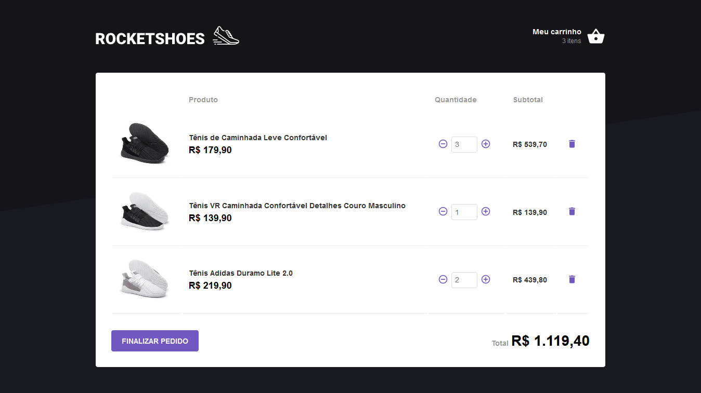
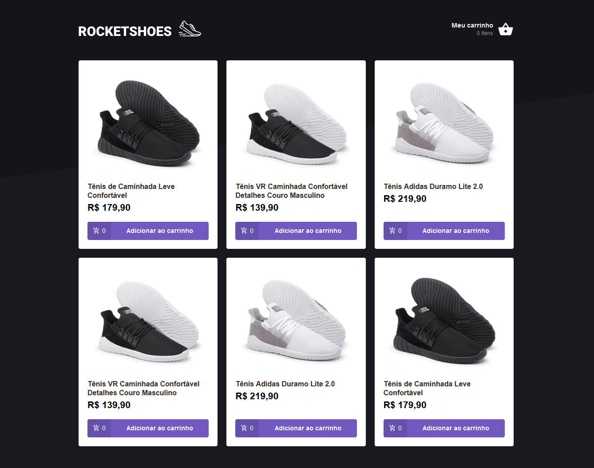
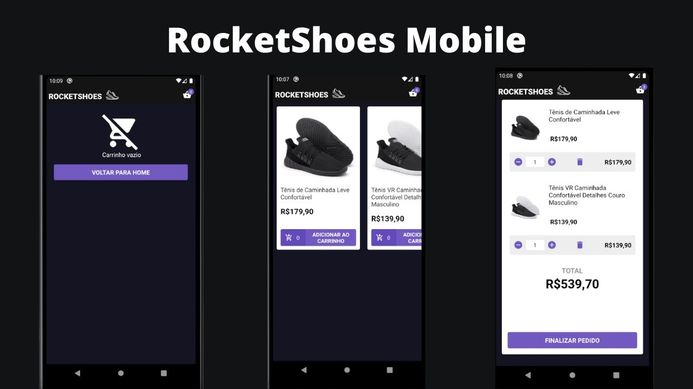

<h2 align="center">
Esse Sistema faz parte do Bootcamp GoStack da RocketSeat, é uma aplicação E commecer Web e Mobile para venda de tenis e sapatos. :rocket: :shoe:.</br>
</h2>
 
<p align="center"> 
 
</p>
 
## :rocket: Tecnologias
- :blue_book: JavaScript
- :computer: Frontend - ReactJs | Sequelize.
- :iphone: Mobile - React Native | Sequelize.

## :open_file_folder: Repositórios
<a href="https://github.com/MitchellSymington/rocketshoes-web"># Repositório WEB</a> </br>
<a href="https://github.com/MitchellSymington/rocketshoes-mobile"># Repositório MOBILE</a> </br>


### WEB
<p float="left"> 
 
 
</p>

### APP
<p float="left"> 
 
</p>


```Tecnologias

```

